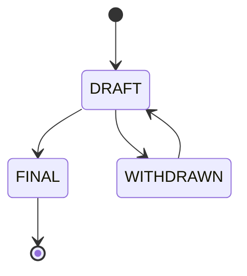

# FEP-a4ed: Fediverse 拡張提案プロセス

!!! Warning
    このFEPは`gemini-2.5-flash`を利用して`2025年08月16日 23時12分`に翻訳されました。オリジナルのFEPは[ここ](https://codeberg.org/fediverse/fep/src/branch/main/fep/a4ed/fep-a4ed.md)から閲覧できます。

## 概要

Fediverse 拡張提案（FEP）は、Fediverse コミュニティに情報を提供する文書です。FEP の目標は、Fediverse を形成する多様なサービス、アプリケーション、コミュニティの相互運用性（interoperability）と健全性（well-being）を向上させることです。

この文書は、Fediverse 拡張提案の範囲、形式、および公開プロセスについて説明します。

## 範囲と目的

Fediverse 拡張提案（FEP）は、Fediverse コミュニティにとって関心のある特定のトピックについて、簡潔かつ焦点を絞った文書であるべきです。

提案は常に、Fediverse の多様なサービス、アプリケーション、コミュニティの相互運用性と健全性を向上させる意図を持つべきです。

Fediverse には、ActivityPub プロトコルや、分散型で多様なソーシャルメディアと文化を育む他のプロトコルを使用するアプリケーション、サービス、コミュニティが含まれます。

提案には、技術的なプロトコルやメカニズムの説明、実験的な作業や現在のベストプラクティスの文書化が含まれる場合があります。

提案は技術的なトピックに限定されず、社会的および文化的側面にも焦点を当てることができます。

提案は（この提案とは異なり）面白く、ユーモラスなものであっても構いません。

## 言語、文書構造、および形式

すべての Fediverse 拡張提案は英語で書かれ、[CommonMark][CommonMark] として適切にフォーマットされ、合理的に文法的である必要があります。

著者は包括的な言葉遣いと例を使用し、[抑圧的な用語][Internet-Draft-terminology]の使用を控えるべきです。

### 提案のタイトルと識別子

すべての Fediverse 拡張提案は、説明的なタイトルを持つ必要があります。

識別子は、提案のタイトルから sha256 ハッシュの最初の4桁（16進数）として計算されます。識別子は標準的な Unix ツールを使用してタイトルから計算できます。

```
$ echo -n "The Fediverse Enhancement Proposal Process" | sha256sum | cut -c-4
a4ed
```

タイトルのハッシュを識別子として使用することで、ファシリテーターがユニークな ID を割り当てる負担を軽減します。これにより、提案のタイトルはユニークである必要があります。

### 提案の種類

Fediverse 拡張提案は以下の種類に分類されます。

- 情報提供文書
- 実装提案

### メタデータ

提案のメタデータは、文書の冒頭に開始と終了の ~---~ の間にキーと値のペアとして配置されます。

以下のメタデータキーと値のペアが提案の冒頭に配置される場合があります。

- `type`：提案の種類を示します。`informational` または `implementation` のいずれかです。
- `slug`：提案の識別子です。値は二重引用符で囲む必要があります（例：`"a4ed"`）。
- `authors`：提案の著者のコンマ区切りリストです。リストの各項目には、著者の名前の後に山括弧で囲まれた連絡先アドレスを含める必要があります（例：`Alyssa P. Hacker <alyssa.p.hacker@email.example>`、`Alyssa P. Hacker <@alyssa.p.hacker@fediverse.example>`）。
- `status`：提案のステータスを示します。`DRAFT`、`WITHDRAWN`、または `FINAL` のいずれかです。
- `dateReceived`：提案がリポジトリに追加された日付です（ステータスが `DRAFT` に設定された場合）。
- `dateWithdrawn`：提案のステータスが `WITHDRAWN` に設定された日付です（ステータスが `WITHDRAWN` の提案のみ）。
- `dateFinalized`：提案のステータスが `FINAL` に設定された日付です（ステータスが `FINAL` の提案のみ）。
- `trackingIssue`：提案のトラッキングイシューへのリンクです。
- `discussionsTo`：議論へのリンクです。
- `relatedFeps`：関連する FEP のコンマ区切りリストです（例：`FEP-a4ed, FEP-141a, FEP-686f`）。
- `replaces`：提案によって置き換えられる FEP のコンマ区切りリストです。
- `replacedBy`：提案を置き換える FEP の識別子です。

### 必須セクション

すべての FEP は、少なくとも以下のセクションを含むべきです。

- 概要：提案の短い（200語以内）要約。
- 著作権：提案がパブリックドメインに置かれていることを示すもの。

以下のセクションは提案に含まれる場合があります。

- 履歴：以前の関連する取り組みの概要と、それらが提案にどのように関連するか。
- 実装：該当する場合、提出時に提案を実装しているサービスまたはアプリケーションの概要。
- 参照：提案によって参照される文書およびリソースのリスト。

### 著作権

Fediverse 拡張提案は、著者が CC0 1.0 Universal (CC0 1.0) Public Domain Dedication を用いてパブリックドメインに置く必要があります。

## Fediverse 拡張提案プロセス



1.  Fediverse 拡張提案は、個人または個人のグループ（著者）によって提出できます。承認された提出方法のリストについては、`SUBMISSION.md` ファイルを参照してください。
2.  7日以内に、ファシリテーターの1人が提案を読み、返答します。ファシリテーターは、提案が必要な構造に準拠しており、FEP の範囲と目的に適合しているかを確認します。ファシリテーターは著者に、提案の明確化、正当化、または撤回を要求する場合があります。このような要求は、ファシリテーターの個人的な偏見を反映してはなりません。むしろ、提出物の高い品質を維持するために厳密に行われます。ファシリテーターは、提案がプロセスの露骨な悪用にあたる場合、提出を拒否する権利を留保します。提出された提案が却下されたり、明確化が要求されたりした場合、著者はより広範なコミュニティからのフィードバックを求めることができます。
3.  FEP ファシリテーターが提出を承認した場合、その提出は `DRAFT` ステータスを受け取り、リポジトリに追加されます。ファシリテーターはまた、提案のトラッキングイシューを作成し、提案のメタデータに `trackingIssue` 属性を追加します。
    - 登録された提案には、以下のメタデータ属性が必要です：`slug`、`authors`、`status`、`dateReceived`、`trackingIssue`、および `discussionsTo`。
    - ステータスが `FINAL` または `WITHDRAWN` に変更された場合、ファシリテーターは提案のメタデータに `dateFinalized` または `dateWithdrawn` 属性を追加します。
4.  提案が `DRAFT` ステータスである間：
    - 著者はコミュニティの議論を開始し、フィードバックを収集する責任があります。
    - 著者は提案の更新を提出することができ、それはファシリテーターによってリポジトリにチェックインされます。他の者も更新を提出できますが、この場合、変更は少なくとも1人の著者によって承認される必要があります。
    - 著者は提出を撤回することができ、その場合、ファシリテーターは提出のステータスを `WITHDRAWN` に設定します。
5.  少なくとも60日後、著者は提案の最終化を要求することができます。これは、提案に対する最終コメントを要求することによって行われます。
    - 14日以内にコミュニティからの異議がなく、著者が提案について十分な認識と議論を開始したことを示せる場合、ファシリテーターは提出のステータスを `FINAL` に設定します。
6.  著者が提案の最終化を要求せず、2年以上更新がない場合、ファシリテーターは提出のステータスを `WITHDRAWN` に設定します。
7.  `FINAL` ステータスの提案は、実装の調整につながるような方法で変更または更新することはできません。軽微な修正は許可されます。
8.  最終化された提案に対する実質的な変更は、別の FEP として提出する必要があります。
    - 新しい FEP は、それが置き換える FEP を指す `replaces` メタデータ属性を含まなければなりません（MUST）。
    - 新しい FEP が `FINAL` になった場合、元の FEP は追加された `replacedBy` メタデータ属性でそれを指さなければなりません（MUST）。
9.  `WITHDRAWN` ステータスの提案はリポジトリに残り、再提出することができます。
10. 提案が `FINAL` になった後、ファシリテーターはトラッキングイシューにリンクされているすべての議論をアーカイブし、結果として得られるアーカイブリンクをトラッキングイシューに追加します。

### ファシリテーター

ファシリテーターのリストは、FEP リポジトリのルートにある `FACILITATORS.md` ファイルで管理されています。

### 提出方法

提案が提出される可能性のある方法のリストは、FEP リポジトリのルートにある `SUBMISSION.md` ファイルで管理されています。

### FEP プロセスガバナンス

FEP-a4ed（Fediverse 拡張提案プロセス）は生きた文書であり、`FINAL` ステータスであっても更新することができます。

誰でも `SUBMISSION.md` ファイルに記載されているいずれかの方法を使用して、FEP-a4ed（または FEP プロセスに関連する他の文書）への変更を提案できます。変更は少なくとも2人のファシリテーターによって承認される必要があります（そのうちの1人は提出者である可能性があります）。FEP プロセスのいかなる部分についても、メンテナンス作業を行うことに同意した十分な数のファシリテーターが存在する必要があります。変更は、ファシリテーターとコミュニティがそれらをレビューし、フィードバックを提供する時間を与えるため、最後の更新から少なくとも1ヶ月が経過するまで承認されるべきではありません。

軽微な変更（例：誤植の修正や壊れたリンクの修正）は、ファシリテーターから2つの承認を得た後、直ちに承認できます。

## 履歴

この提案で説明されているプロセスと形式は、[BitTorrent Enhancement Proposal Process][BEP-1]、[Scheme Request for Implementation][SRFI]、および [IETF RFC Series][RFC-8729] など、他のコミュニティ主導の文書化の取り組みに影響を受けています。

## 参照

- Dave Mason, [Scheme Request For Implementation - Process][SRFI]
- David Harrison, [The BitTorrent Enhancement Proposal Process][BEP-1], 2008
- Housley, R., Ed., and L. Daigle, Ed., [The RFC Series and RFC Editor][RFC-8729], 2020
- John MacFarlane, [CommonMark Spec Version 0.29][CommonMark], 2019
- Mallory Knodel, [Terminology, Power and Oppressive Language][Internet-Draft-terminology]

[SRFI]: https://srfi.schemers.org/srfi-process.html
[BEP-1]: http://bittorrent.org/beps/bep_0001.html
[RFC-8729]: https://www.rfc-editor.org/info/rfc8729
[CommonMark]: https://spec.commonmark.org/0.29/
[Internet-Draft-terminology]: https://tools.ietf.org/html/draft-knodel-terminology

## 著作権

CC0 1.0 Universal (CC0 1.0) Public Domain Dedication

法的に可能な限り、この Fediverse 拡張提案の著者は、この著作物に対するすべての著作権および関連する権利または隣接する権利を放棄しています。